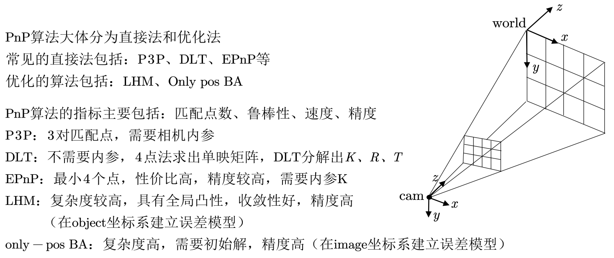

##  1. PnP 算法简单介绍

​	PnP(pespective-n-point) , 求解3D-2D点对运动的方法。在已知n个三维空间点坐标（相对于某个指定的坐标系A）及其二维投影位置的情况下，估计相机的位姿（即相机在坐标系A下的姿态）的方法。
​	 PNP 的问题是一致的，不同的就是在已知3D-2D的点对的情况下，怎么求出相机的位姿或者说点对在相机坐标系下的姿态。常见的PNP问题的求解方法，有以下几种:


- 直接线性变换DLT
- EPnP：
  利用已知的3d点，通过PCA选择4个控制点，建立新的局部坐标系，从而将3d坐标用新的控制点表示出来。然后，利用相机投影模型和2d点，转换到相机坐标系中，再在相机坐标系中建立和世界坐标系同样关系（每个点在相机坐标系和世界坐标系下控制点处的坐标一致）的4个控制点，求解出相机坐标系下的四个控制点的坐标，进而利用ICP求解pose。 
- SDP
- P3P
- UPnP
- 非线性优化方法等……

##  2. opencv 函数说明:

[solvePnPRansac  by opencv doc](https://docs.opencv.org/3.1.0/d9/d0c/group__calib3d.html#ga50620f0e26e02caa2e9adc07b5fbf24e)

```c++

bool solvePnPRansac(InputArray _opoints, InputArray _ipoints,
	InputArray _cameraMatrix, InputArray _distCoeffs,
	OutputArray _rvec, OutputArray _tvec, bool useExtrinsicGuess,
	int iterationsCount, float reprojectionError, double confidence,
	OutputArray _inliers, int flags)

参数说明：
objectPoints - 世界坐标系下的控制点的坐标，vector<Point3f>的数据类型在这里可以使用
imagePoints - 在图像坐标系下对应的控制点的坐标。vector<Point2f>在这里可以使用
cameraMatrix - 相机的内参矩阵
distCoeffs - 相机的畸变系数
rvec - 输出的旋转向量。使坐标点从世界坐标系旋转到相机坐标系
tvec - 输出的平移向量。使坐标点从世界坐标系平移到相机坐标系
flags - 默认使用CV_ITERATIV迭代法
     SOLVEPNP_ITERATIVE(此方案，最小模型用的EPNP，内点选出之后用了一个迭代)；
     SOLVE_P3P(P3P只用在最小模型上，内点选出之后用了一个EPNP)
     SOLVE_AP3P(AP3P只用在最小模型上，内点选出之后用了一个EPNP)
     SOLVE_EPnP(最小模型上&内点选出之后都采用了EPNP)
```


## 3. 实验数据与结果分析

### 3.0.  SOLVEPNP_ITERATIVE

   

   

```
 evo_traj tum frame_traj_est_SOLVEPNP_ITERATIVE.txt --ref=frame_traj_gt_SOLVEPNP_ITERATIVE.txt -p --plot_mode xyz  --align --correct_scale
```


```
evo_ape tum frame_traj_est_SOLVEPNP_ITERATIVE.txt frame_traj_gt_SOLVEPNP_ITERATIVE.txt  -va --plot --plot_mode xyz --save_results SOLVEPNP_ITERATIVE_ape.zip
       max	0.434389
      mean	0.178372
    median	0.171207
       min	0.039869
      rmse	0.197632
       sse	3.749621
       std	0.085099
```
```

 evo_rpe tum frame_traj_est_SOLVEPNP_ITERATIVE.txt frame_traj_gt_SOLVEPNP_ITERATIVE.txt  -va --plot --plot_mode xyz --save_results SOLVEPNP_ITERATIVE_rpe.zip

       max	4.377182
      mean	2.601915
    median	2.644808
       min	0.074727
      rmse	2.779581
       sse	733.976471
       std	0.977806
```
```
evo_res SOLVEPNP_ITERATIVE_ape.zip -p --save_table SOLVEPNP_ITERATIVE_table.csv

                          max      mean    median        min      rmse  \
frame_traj_gt_SOL...  0.434389  0.178372  0.171207  0.0398691  0.197632   

                          sse        std  
frame_traj_gt_SOL...  3.74962  0.0850991  
```


### 3.1. SOLVEPNP_EPNP
   
```
 evo_traj tum frame_traj_est_SOLVEPNP_EPNP.txt --ref=frame_traj_gt_SOLVEPNP_EPNP.txt -p --plot_mode xyz  --align --correct_scale
```


```
evo_ape tum frame_traj_est_SOLVEPNP_EPNP.txt frame_traj_gt_SOLVEPNP_EPNP.txt  -va --plot --plot_mode xyz --save_results SOLVEPNP_EPNP_ape.zip
       max	0.242836
      mean	0.117471
    median	0.114078
       min	0.017015
      rmse	0.126450
       sse	1.534998
       std	0.046799
```
```
 evo_rpe tum frame_traj_est_SOLVEPNP_EPNP.txt frame_traj_gt_SOLVEPNP_EPNP.txt  -va --plot --plot_mode xyz --save_results SOLVEPNP_EPNP_rpe.zip

       max	4.352881
      mean	2.587162
    median	2.637466
       min	0.074727
      rmse	2.763539
       sse	725.528841
       std	0.971461
```
```
evo_res SOLVEPNP_EPNP_ape.zip -p --save_table SOLVEPNP_EPNP_table.csv

                           max      mean    median        min     rmse    sse  \
frame_traj_gt_SOL...  0.242836  0.117471  0.114078  0.0170151  0.12645  1.535   

                            std  
frame_traj_gt_SOL...  0.0467992  
```


### 3.2. SOLVEPNP_P3P

   

```
 evo_traj tum frame_traj_est_SOLVEPNP_P3P.txt --ref=frame_traj_gt_SOLVEPNP_P3P.txt -p --plot_mode xyz  --align --correct_scale
```


```
evo_ape tum frame_traj_est_SOLVEPNP_P3P.txt frame_traj_gt_SOLVEPNP_P3P.txt  -va --plot --plot_mode xyz --save_results SOLVEPNP_P3P_ape.zip
       max	0.246748
      mean	0.116399
    median	0.108588
       min	0.040195
      rmse	0.124018
       sse	1.476530
       std	0.042799
```
```

 evo_rpe tum frame_traj_est_SOLVEPNP_P3P.txt frame_traj_gt_SOLVEPNP_P3P.txt  -va --plot --plot_mode xyz --save_results SOLVEPNP_P3P_rpe.zip

       max	4.376081
      mean	2.589348
    median	2.609933
       min	0.031821
      rmse	2.764878
       sse	726.232326
       std	0.969448
```
```
evo_res SOLVEPNP_P3P_ape.zip -p --save_table SOLVEPNP_P3P_table.csv

                           max      mean    median        min      rmse  \
frame_traj_gt_SOL...  0.246748  0.116399  0.108588  0.0401949  0.124018   

                          sse        std  
frame_traj_gt_SOL...  1.47653  0.0427988  
0.246748
0.116399
0.108588
0.0401949
0.124018
1.47653
0.0427988 
```

### 3.3. SOLVEPNP_DLS
   
```
 evo_traj tum frame_traj_est_SOLVEPNP_DLS.txt --ref=frame_traj_gt_SOLVEPNP_DLS.txt -p --plot_mode xyz  --align --correct_scale
```


```
evo_ape tum frame_traj_est_SOLVEPNP_DLS.txt frame_traj_gt_SOLVEPNP_DLS.txt  -va --plot --plot_mode xyz --save_results SOLVEPNP_DLS_ape.zip
       max	0.225975
      mean	0.113513
    median	0.106261
       min	0.035635
      rmse	0.122289
       sse	1.435645
       std	0.045492
```
```

 evo_rpe tum frame_traj_est_SOLVEPNP_DLS.txt frame_traj_gt_SOLVEPNP_DLS.txt  -va --plot --plot_mode xyz --save_results SOLVEPNP_DLS_rpe.zip

       max	4.333318
      mean	2.583120
    median	2.601981
       min	0.017241
      rmse	2.759503
       sse	723.411568
       std	0.970746

```
```
evo_res SOLVEPNP_DLS_ape.zip -p --save_table SOLVEPNP_DLS_table.csv

                           max      mean    median        min      rmse  \
frame_traj_gt_SOL...  0.225975  0.113513  0.106261  0.0356351  0.122289   

                          sse        std  
frame_traj_gt_SOL...  1.43565  0.0454917  

```

### 3.4. SOLVEPNP_UPNP
   
```
 evo_traj tum frame_traj_est_SOLVEPNP_UPNP.txt --ref=frame_traj_gt_SOLVEPNP_UPNP.txt -p --plot_mode xyz  --align --correct_scale
```


```
evo_ape tum frame_traj_est_SOLVEPNP_UPNP.txt frame_traj_gt_SOLVEPNP_UPNP.txt  -va --plot --plot_mode xyz --save_results SOLVEPNP_UPNP_ape.zip
       max	0.218468
      mean	0.106990
    median	0.094463
       min	0.033494
      rmse	0.115861
       sse	1.288688
       std	0.044462
```
```

 evo_rpe tum frame_traj_est_SOLVEPNP_UPNP.txt frame_traj_gt_SOLVEPNP_UPNP.txt  -va --plot --plot_mode xyz --save_results SOLVEPNP_UPNP_rpe.zip

       max	4.361522
      mean	2.585335
    median	2.631826
       min	0.016013
      rmse	2.760945
       sse	724.167897
       std	0.968950
```
```
evo_res SOLVEPNP_UPNP_ape.zip -p --save_table SOLVEPNP_UPNP_table.csv

                           max     mean     median        min      rmse  \
frame_traj_gt_SOL...  0.218468  0.10699  0.0944627  0.0334936  0.115861   

                          sse        std  
frame_traj_gt_SOL...  1.28869  0.0444622 
```

### 3.5. SOLVEPNP_AP3P
   
```
 evo_traj tum frame_traj_est_SOLVEPNP_AP3P.txt --ref=frame_traj_gt_SOLVEPNP_AP3P.txt -p --plot_mode xyz  --align --correct_scale
```


```
evo_ape tum frame_traj_est_SOLVEPNP_AP3P.txt frame_traj_gt_SOLVEPNP_AP3P.txt  -va --plot --plot_mode xyz --save_results SOLVEPNP_AP3P_ape.zip
       max	0.236128
      mean	0.105609
    median	0.097849
       min	0.034734
      rmse	0.116205
       sse	1.296356
       std	0.048481
```
```

 evo_rpe tum frame_traj_est_SOLVEPNP_AP3P.txt frame_traj_gt_SOLVEPNP_AP3P.txt  -va --plot --plot_mode xyz --save_results SOLVEPNP_AP3P_rpe.zip

       max	4.316022
      mean	2.581949
    median	2.619087
       min	0.016013
      rmse	2.758708
       sse	722.994698
       std	0.971603
```
```
evo_res SOLVEPNP_AP3P_ape.zip -p --save_table SOLVEPNP_AP3P_table.csv

                           max      mean     median       min      rmse  \
frame_traj_gt_SOL...  0.236128  0.105609  0.0978492  0.034734  0.116205   

                          sse        std  
frame_traj_gt_SOL...  1.29636  0.0484811  
```

### 3.6.  SOLVEPNP_MAX_COUNT
      
```
 evo_traj tum frame_traj_est_SOLVEPNP_MAX_COUNT.txt --ref=frame_traj_gt_SOLVEPNP_MAX_COUNT.txt -p --plot_mode xyz  --align --correct_scale
```


```
evo_ape tum frame_traj_est_SOLVEPNP_MAX_COUNT.txt frame_traj_gt_SOLVEPNP_MAX_COUNT.txt  -va --plot --plot_mode xyz --save_results SOLVEPNP_MAX_COUNT_ape.zip
       max	0.262875
      mean	0.090947
    median	0.078453
       min	0.025371
      rmse	0.101519
       sse	0.989395
       std	0.045109
```
```

 evo_rpe tum frame_traj_est_SOLVEPNP_MAX_COUNT.txt frame_traj_gt_SOLVEPNP_MAX_COUNT.txt  -va --plot --plot_mode xyz --save_results SOLVEPNP_MAX_COUNT_rpe.zip

       max	4.313694
      mean	2.582501
    median	2.616074
       min	0.016013
      rmse	2.758629
       sse	722.953111
       std	0.969907
```
```
evo_res SOLVEPNP_MAX_COUNT_ape.zip -p --save_table SOLVEPNP_MAX_COUNT_table.csv

                           max       mean     median        min      rmse  \
frame_traj_gt_SOL...  0.262875  0.0909472  0.0784525  0.0253707  0.101519   

                           sse        std  
frame_traj_gt_SOL...  0.989395  0.0451088 


```

### 3.7 结果分析  

```
method: 0~6 依次代表以下方法：
SOLVEPNP_ITERATIVE
SOLVEPNP_EPNP       
SOLVEPNP_P3P      
SOLVEPNP_DLS        
SOLVEPNP_UPNP      
SOLVEPNP_AP3P       
SOLVEPNP_MAX_COUNT
```

evo_ape(计算绝对位姿误差）

| **param** | **0**    | **1**    | **2**    | **3**    | **4**        | **5**    | **6**        |
| --------- | -------- | -------- | -------- | -------- | ------------ | -------- | ------------ |
| max       | 0.434389 | 0.242836 | 0.246748 | 0.225975 | 0.218468     | 0.236128 | 0.262875     |
| mean      | 0.178372 | 0.117471 | 0.116399 | 0.113513 | 0.10699      | 0.105609 | **0.090947** |
| median    | 0.171207 | 0.114078 | 0.108588 | 0.106261 | 0.094463     | 0.097849 | 0.078453     |
| min       | 0.039869 | 0.017015 | 0.040195 | 0.035635 | 0.033494     | 0.034734 | 0.025371     |
| rmse      | 0.197632 | 0.12645  | 0.124018 | 0.122289 | 0.115861     | 0.116205 | 0.101519     |
| sse       | 3.749621 | 1.534998 | 1.47653  | 1.435645 | 1.288688     | 1.296356 | **0.989395** |
| std       | 0.085099 | 0.046799 | 0.042799 | 0.045492 | **0.044462** | 0.048481 | 0.045109     |

**evo_rpe(计算相对位姿误差)**

| **param** | **0**      | **1**      | **2**      | **3**      | **4**       | **5**      | **6**        |
| --------- | ---------- | ---------- | ---------- | ---------- | ----------- | ---------- | ------------ |
| max       | 4.377182   | 4.352881   | 4.376081   | 4.333318   | 4.361522    | 4.316022   | 4.313694     |
| mean      | 2.601915   | 2.587162   | 2.589348   | 2.58312    | 2.585335    | 2.581949   | 2.582501     |
| median    | 2.644808   | 2.637466   | 2.609933   | 2.601981   | 2.631826    | 2.619087   | **2.616074** |
| min       | 0.074727   | 0.074727   | 0.031821   | 0.017241   | 0.016013    | 0.016013   | 0.016013     |
| rmse      | 2.779581   | 2.763539   | 2.764878   | 2.759503   | 2.760945    | 2.758708   | **2.758629** |
| sse       | 733.976471 | 725.528841 | 726.232326 | 723.411568 | 724.167897  | 722.994698 | 722.953111   |
| std       | 0.977806   | 0.971461   | 0.969448   | 0.970746   | **0.96895** | 0.971603   | 0.969907     |

**evo_res(结果比较)**

| **param**                        | **0**                                                        | **1**                                                        | **2**                                                        | **3**                                                        | **4**                                                        | **5**                                                        | **6**                                                        |
| -------------------------------- | ------------------------------------------------------------ | ------------------------------------------------------------ | ------------------------------------------------------------ | ------------------------------------------------------------ | ------------------------------------------------------------ | ------------------------------------------------------------ | ------------------------------------------------------------ |
| max mean median min rmse sse Std | 0.434389 0.178372 0.171207 0.0398691 0.197632 3.74962 0.0850991 | 0.242836 0.117471 0.114078 0.0170151 0.12645 1.535 0.0467992 | 0.246748 0.116399 0.108588 0.0401949 0.124018 1.47653 0.0427988 | 0.225975 0.113513 0.106261 0.0356351 0.122289 1.43565 0.0454917 | 0.218468 0.10699 0.0944627 0.0334936 0.115861 1.28869 **0.0444622** | 0.236128 0.105609 0.0978492 0.034734 0.116205 1.29636 0.0484811 | 0.262875 **0.0909472** 0.0784525 0.0253707 **0.101519** 0.989395 0.0451088 |

整个轨迹估计时间消耗（ms）, 基本都在4 sec左右

| **param** | **0**   | **1**   | **2**   | **3**   | **4**   | **5**   | **6**   |
| --------- | ------- | ------- | ------- | ------- | ------- | ------- | ------- |
| time      | 4087322 | 4007796 | 3819130 | 3435533 | 3819258 | 3712575 | 3041394 |

综合比较， SOLVEPNP_MAX_COUNT 方法估计的精度更加准确可靠，整体方法比对相差不大.

## 4. 注意点

1. solvePnPRansac 求得的R.t 为 相机的世界坐标在相机坐标系下的表示。


